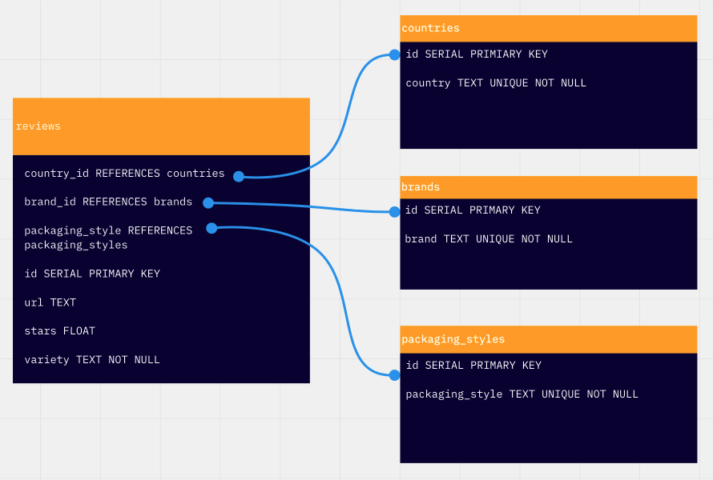

# 03 Exercise - Ramen Reviews

Ramen Reviews packaged with SQL!

## Brief

A dataset of ramen reviews has been provided in [data/sql](./data/sql). In this exercise you need to complete the functions in [repository.js](./repository.js) to perform CRUD operations on the review data stored in a SQL server.

## Getting Started

First, start up a Docker container with a new PostgreSQL database and automatically load the ramen review tables and data:

```shell
docker run -d \
  --name ramen-reviews-db \
  -p 5432:5432 \
  -e POSTGRES_PASSWORD=password \
  -v ramen-reviews-db:/var/lib/postgresql/data \
  -v "$(pwd)/data/sql:/docker-entrypoint-initdb.d" \
  -d \
  postgres
```

<details>
  <summary>Docker refresher</summary>

- `\` - This is the terminal syntax to ignore the new line and carry on reading commands from the next line.
- `--name` - A friendly name so we can reference the container later by name instead of an ID or randomly generated name.
- `-p 5432:5432` - this is the traditional port on which PostgreSQL runs. We are allowing this port on our local machine to access 5432 on the container.
- `-e POSTGRES_PASSWORD=password` - The default password for your Postgres admin user.
- `-v ramen-reviews-db:/var/lib/postgresql/data` - This creates a persistent volume named `ramen-reviews-db` and mounts the volume inside the container filesystem at `/var/lib/postgresql/data`. If you ever delete the container it is easy to spin up a new container without losing your data as the persistent volume can be re-used between containers.
- `-v "$(pwd)/data:/docker-entrypoint-initdb.d"` - After the entrypoint calls `initdb` to create the default postgres user and database, it will run any `*.sql` files found in the `$(pwd)/data` directory (the `pwd` command (print working directory) writes the full pathname of the current working directory to the standard output). (Scripts in `/docker-entrypoint-initdb.d` are only run if you start the container with a data directory that is empty; any pre-existing database will be left untouched on container startup.)
- `-d` - Run the container in detached mode (or in the background) as we don't need access to the terminal inside the container.
- `postgres` - The name of the container image to run. Note, there is no image tag specified, so Docker will use the latest image.

</details>

1. Open a Terminal in VS Code for this project
2. Type `npm install` to install npm dependencies
3. Type `npm start` to start the Express Server
4. Open `http://localhost:5001/` in your browser to view the [Swagger UI](https://swagger.io/tools/swagger-ui/) generated API docs.

**Database schema**

This is the database schema for the tables loaded into the database:



**Tests**

This exercise comes with unit tests to check your code against. Make sure the PostgreSQL container is running before running the tests.

```zsh
npm test
```

## Instructions

Implement the functions in `repository.js` using [`pool.query()`](https://node-postgres.com/features/queries). Check the [API spec file](./apispec.yaml) for details on the expected responses.

**Acceptance Criteria:**

- [ ] All functions in `repository.js` are implemented
- [ ] All tests in `repository.test.js` pass
- [ ] Commits are pushed to GitHub
- [ ] The exercise has been submitted in Google Classroom
